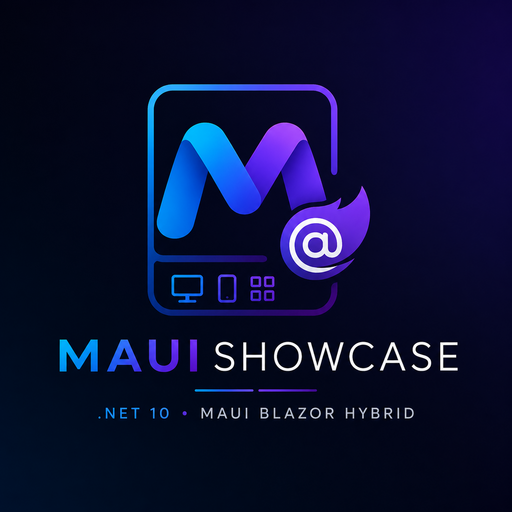

<div align="center">
  
  <h1 align="center">net-maui-showcase</h1>
  <p align="center">
    O mesmo app de ERP rodando no navegador e como aplicativo nativo,<br>
    de um código só: .NET 10, MAUI Blazor Hybrid e MudBlazor.
  </p>
  <a href="https://dotnet.microsoft.com"></a>
  <a href="https://learn.microsoft.com/dotnet/csharp/"></a>
  <a href="https://dotnet.microsoft.com/apps/maui"></a>
  <a href="https://mudblazor.com"></a>
  <a href="https://learn.microsoft.com/ef/core/"></a>
  <br>
  
  <a href="../../releases/latest/download/maui-showcase-windows-setup.exe"></a>
  <a href="../../releases/latest/download/maui-showcase-android.apk"></a>
</div>

<br>

Espelho público de distribuição do **net-maui-showcase**. Aqui moram só os
binários; o código-fonte vive no repositório de desenvolvimento.

> **Versão publicada: v1.1.0**
>
> Este repositório guarda **uma versão só**. Cada publicação apaga a release e a
> tag anteriores, então o que está em [Releases](../../releases/latest) é sempre o
> estado corrente do `main`. O histórico de mudanças mora no CHANGELOG do
> repositório de desenvolvimento, não aqui.

## Baixar

| Plataforma | Arquivo | Requisito |
| :-- | :-- | :-- |
| Windows | [`maui-showcase-windows-setup.exe`](../../releases/latest/download/maui-showcase-windows-setup.exe) | Windows 10 ou 11, 64 bits |
| Android | [`maui-showcase-android.apk`](../../releases/latest/download/maui-showcase-android.apk) | Android 8.0 ou superior |
| iOS | (sem download) | atendido pela versão web |

**Por que não há iOS.** Um `.ipa` não se instala por download: a Apple só permite
App Store, TestFlight ou distribuição ad-hoc com o UDID de cada aparelho
cadastrado em conta paga de desenvolvedor. Quem está no iPhone abre a versão web,
que roda exatamente o mesmo código de interface.

## O que esperar ao abrir

**Windows.** O instalador não é assinado por certificado de código, então o
SmartScreen mostra um aviso na primeira execução: clique em **Mais informações**
e depois em **Executar assim mesmo**. A instalação é por usuário, em
`%LOCALAPPDATA%\Programs\MauiShowcase`, e por isso **não pede permissão de
administrador**. O pacote é self-contained: o runtime .NET e o Windows App SDK
vão embutidos, nada precisa ser instalado antes.

**Android.** O APK é assinado com certificado autoassinado, o suficiente para
instalar e sem custo. O sistema vai pedir para autorizar a instalação a partir
do aplicativo que abriu o arquivo.

## Atualizar de uma versão anterior

Como este repositório guarda uma versão só, quem volta aqui já tem a anterior
instalada. Baixe e abra normalmente: **não é preciso desinstalar antes**.

No Windows o instalador reconhece a instalação anterior pelo identificador do
aplicativo, troca os arquivos e mantém um atalho só. Ele remove o que a versão
nova não usa mais, então nada de sobra se acumula a cada atualização. Feche o
aplicativo antes de rodar o instalador; se estiver aberto, ele pede para fechar.

No Android o sistema instala por cima, porque cada versão publicada carrega um
número de versão maior que o da anterior e o pacote é assinado sempre com a
mesma chave. O ícone, o nome e os dados do aplicativo continuam os mesmos.

## O aplicativo

Um showcase de ERP: clientes, lançamentos financeiros e um dashboard. É o irmão
mobile de uma família de três demonstrações que apresentam o mesmo produto em
plataformas diferentes.

- **Domínio:** `Customer` (nome, e-mail, documento, segmento, nascimento, ativo) e
  `FinancialEntry` (tipo, valor, cliente, data, descrição)
- **Interface:** MAUI Blazor Hybrid com MudBlazor, tema claro e escuro
- **Dados:** SQLite local via EF Core, com seed de demonstração no primeiro start
- **Acesso:** credencial de demonstração, já preenchida na tela de login

Os dados nascem e morrem no aparelho. Não há servidor, não há sincronização,
nada é enviado para lugar nenhum.

## Padrão do projeto

O repositório de desenvolvimento é organizado em três projetos e uma suíte:

```
src/App.Shared    Razor Class Library: toda a interface e o domínio,
                  compartilhados pelos dois heads
src/App           head MAUI (Android, iOS, Windows, Mac Catalyst)
src/App.Web       head web (Blazor WebAssembly), publicado como site estático
tests/            xUnit v3 + bUnit, com SQLite em memória
```

A regra que sustenta o arranjo: **`App.Shared` só depende de interfaces**. Tudo
que é específico de plataforma (armazenamento local, caminho do banco,
exportação de arquivo) entra por injeção, e cada head traz a sua implementação.
É isso que permite o mesmo código de tela rodar no celular e no navegador sem
ramificação.

## Stack

.NET 10 · C# 14 · MAUI 10 · Blazor Hybrid · MudBlazor 9 · EF Core 10 · SQLite

## Licença

Os binários seguem a licença do repositório de desenvolvimento.
